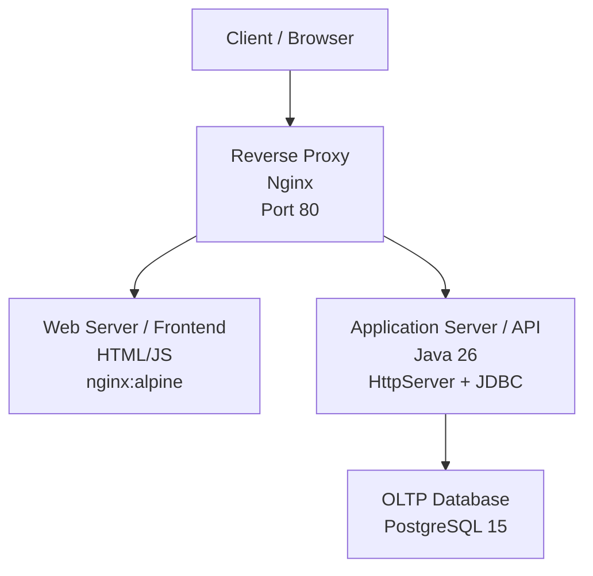
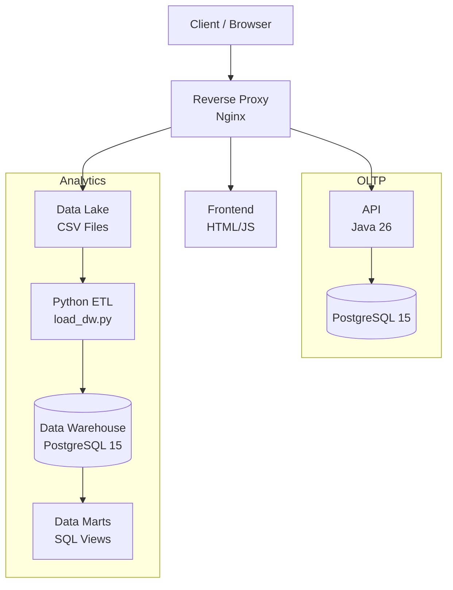

# ADA - Arquitetura de Serviços e Dados

Projeto final integrando **Arquitetura de Serviços** (Docker, Docker Compose, Nginx, CI/CD, DNS) e **Arquitetura de Dados** (Data Lake, Data Warehouse, Data Mart, SQL)

## Overview

Ecossistema end-to-end contendo duas áreas:

1. **CRUD de produtos** - Proxy reverso Nginx + frontend HTML/JS + API REST Java + PostgreSQL (OLTP).
2. **Ecossistema de dados MovieFlix** - Arquitetura 3-layer: Data Lake (CSV) -> Data Warehouse (PostgreSQL) -> (SQL views) com queries analíticas.

## Arquitetura

### CRUD de Produtos


### Ecossistema de dados + CRUD de Produtos



## Stack de Desenvolvimento

| Component | Technology |
|-----------|-----------|
| Backend API | Java 26, `com.sun.net.httpserver.HttpServer`, JDBC |
| Frontend | HTML, CSS, JavaScript (vanilla) |
| Reverse Proxy | Nginx (Alpine) |
| OLTP Database | PostgreSQL 15 (Alpine) |
| Data Warehouse | PostgreSQL 15 (Alpine) |
| ETL Scripts | Python (psycopg2) |
| Orchestration | Docker Compose |
| CI/CD | GitHub Actions |


## Estrutura do Repositório

```
.
├── .github/
│   └── workflows/              # CI/CD pipeline
│
├── nginx/                      # Reverse proxy
│   ├── Dockerfile
│   └── nginx.conf
│
├── frontend/                   # HTML/JS web interface
│   ├── Dockerfile
│   └── index.html
│
├── backend/                    # Java 26 REST API
│   ├── Dockerfile
│   └── src/
│       └── main/
│           ├── java/
│           │   └── com/products/*
│           └── resources/
│               └── SQL init scripts
│
├── data-ecosystem/
│   ├── datalake/
│   │   ├── movies.csv
│   │   ├── users.csv
│   │   └── ratings.csv
│   │
│   ├── etl/
│   │   └── load_dw.py
│   │
│   └── sql/
│       ├── dw-schema.sql
│       ├── data-marts.sql
│       └── analytics-queries.sql
│
├── scripts/                    # PowerShell test scripts
│
├── docker-compose.yml          # Service orchestration
└── README.md
```

## Getting Started

### Pré-requisitos

- Docker e Docker Compose
- Java 26
- PostgreSQL 15

### Execução - Docker Compose
```bash
docker compose up -d --build
```

Esta aplicação vai estar disponível em:

| Service | URL |
|---------|-----|
| App (Frontend + API) | http://localhost |
| Health check | http://localhost/health |
| OLTP Database | localhost:5432 |

### Para execução

```bash
docker compose down -v
```

## Enpoints da API


| Method | Endpoint | Description | Status Code |
|--------|----------|-------------|-------------|
| `GET` | `/api/products` | List all products | 200 |
| `GET` | `/api/products/{id}` | Get product by ID | 200 / 404 |
| `POST` | `/api/products` | Create a new product | 201 |
| `PUT` | `/api/products/{id}` | Update a product | 200 / 404 |
| `DELETE` | `/api/products/{id}` | Delete a product | 204 / 404 |
| `GET` | `/health` | Health check | 200 |

### Exemplos de Request/Response
**Criar produto:**
```bash
curl -X POST http://localhost/api/products \
  -H "Content-Type: application/json" \
  -d '{"name": "Notebook"}'
```
Resposta: `{"id":1,"name":"Notebook"}`

**Listar todos os produtos:**
```bash
curl http://localhost/api/products
```
Response: `[{"id":1,"name":"Notebook"},{"id":2,"name":"Mouse"}]`

## Scripts de Teste

Scripts de testes manuais e automatizados podem ser encontrados na pasta `scripts/`. Todos os scripts gerenciam setup, teste e cleanup.

### Fase 1 — Backend API

Compila e roda o backend em java localmente com um container Docker PostgreSQL. Testa todos os endpoints (`GET`, `POST`, `PUT`, `DELETE`) e o health check diretamente na porta 8080.

```powershell
powershell -ExecutionPolicy Bypass -File scripts\phase-1-test.ps1
```

### Fase 2 — Backend + Frontend

Continua a fase 1, adicionando o container do frontend e verifica que o servidor Nginx serve corretamente a pagina HTML. Testa o banckend e frontend de forma separada, sem proxy reverso.

```powershell
powershell -ExecutionPolicy Bypass -File scripts\phase-2-test.ps1
```

### Fase 3 — Integração Completa

Executa todos os serviços via Docker Compose (proxy, frontend, backend, PostgreSQL). Testa todos os endpoints do CRUD através do proxy reverso na porta 80.

```powershell
powershell -ExecutionPolicy Bypass -File scripts\phase-3-test.ps1
```

### Manual tests (browser)

Inicializa todos os serviços e disponibiliza o serviço em http://localhost para fins de testes manuais no browser. Precione qualquer tecla no terminal para encerrar o processo e iniciar o processo de cleanup.

```powershell
# Phase 2: Frontend only (backend local, frontend in Docker)
powershell -ExecutionPolicy Bypass -File scripts\phase-2-test-manual.ps1

# Phase 3: Full integration (all services in Docker)
powershell -ExecutionPolicy Bypass -File scripts\phase-3-test-manual.ps1
```

### Pular cleanup

Todos os testes automatizados suportam `-SkipCleanup` para manter os serviços rodando depois dos testes:

## Entregaveis

- [x] Phase 0: Project scaffolding
- [x] Phase 1: Backend API (Java 26 Products CRUD)
- [x] Phase 2: Frontend (HTML/JS)
- [x] Phase 3: Reverse proxy (Nginx)
- [x] Phase 4: docker-compose.yml orchestration
- [ ] Phase 5: Data ecosystem (MovieFlix)
- [ ] Phase 6: CI/CD (GitHub Actions)
- [ ] Phase 7: DNS bonus + final README
